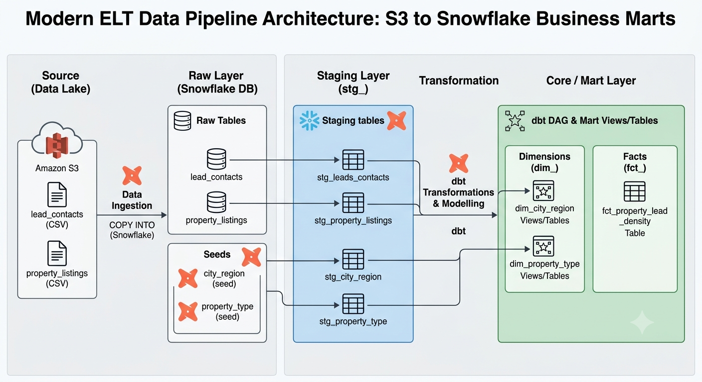
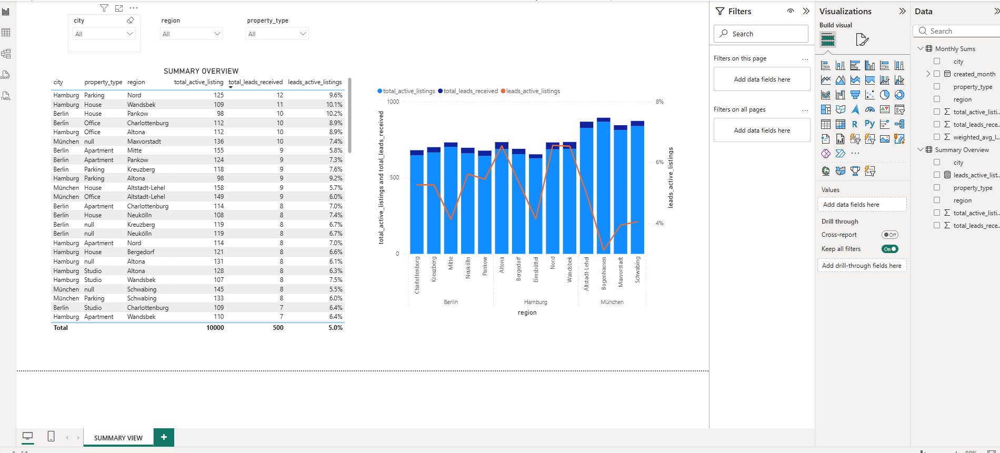

# Aviv Group Case Study
Aviv Data Platform and Analytics Engineering Case

## The Data
The raw data consists of two data sources:

* **Property Listings:** `listing_id`, `property_type` (e.g., apartment, house, parking), `city`, `region`, `price`, `created_at`, `updated_at`, `agent_id`
* **Lead Contacts:** `contact_id`, `listing_id`, `contact_source` (organic, paid, partner), `contact_timestamp`

## Tasks

### Database
Since I do not have a Snowflake account, I used my free PostgreSQL account on supabase.com.

### Load The Data
The data is created under the `seed` folder in this project. 

I would prefer to load the data into Snowflake through dbt data models using Snowflake's `COPY INTO` command. This approach provides the flexibility to manage the loading and scheduling of the raw data sources within the same environment as the other data models. 

I would only prefer using Snowsight for one-off data movements or when data needs to be loaded just a few times. If the data size is large, the `COPY INTO` command will perform significantly better than Snowsight loads. 

Other solutions are also possible, such as external tables (linking directly to files, which is better for archived, unchanged data files), Python code (Snowpark), or third-party tools like DataVirtuality, Daton, or Fivetran. However, these options come with their own disadvantages. The best practice is to manage data models and data loads internally within the company.

### Model with dbt
* **Staging Models:** Please check the folder: `models/staging/*`
* **Mart Models:** Please check the folder: `models/datamarts/*`

For better readability and maintenance, it is best practice to have one `.yml` file for each data model and define test cases within those specific files. That is why each data model has its own `.yml` file sharing the exact same name as the model.

### Ensure Data Quality
* I defined surrogate keys based on natural keys and configured uniqueness and not-null data quality tests for them. Defining uniqueness tests ensures that data is not duplicated and is loaded correctly. For critical data, including amounts and quantities, ensuring unique data is crucial.
* I created dimension tables and defined relational data tests to ensure data integrity between tables. We can handle missing values in a few ways: with errors (preventing the records from being loaded), warnings (triggering alerts to decide on a solution later while letting the data load), or by defining a default dummy value to load all data and handling that default value in relevant downstream cases. 
* I created a custom data test under the `tests` folder to check whether a price is negative. These types of data tests can be defined based on business rules to catch anomalies, extreme outliers, or unexpected values.

### Business Value
* Guides marketing teams on where to allocate ad spend to acquire high-value users.
* Pinpoints hidden market opportunities for the Sales and Account Management teams.
* Empowers B2B sales teams with concrete data to sell premium features (e.g., "Featured Listings", "Top Slots").

### Architecture
* **S3 Storage:** Loading data files to an AWS S3 bucket offers the flexibility to reload data from scratch if the data in the DWH is corrupted or accidentally deleted. It also provides an efficient way to archive historical data.
* **Snowflake Ingestion:** Reading data from the S3 bucket and loading it into Snowflake using `COPY INTO` within a structured dbt project, utilizing a macro to streamline file loading.
* **dbt Transformation:** Cleaning, processing data, and creating staging models alongside mart/dimension tables in the dbt datamart layer.
* **Monitoring & Alerting:** For orchestration and monitoring, I would prefer using Airflow running on AWS ECS, keeping logs centralized, and setting up dedicated Teams channels to track errors. Furthermore, we can build visual reports to monitor whether business KPIs are behaving normally (e.g., tracking if metrics are too high or too low compared to the last 30 days' average or standard deviation).
* **Core Philosophy:** The key design decisions are heavily based on how easily the project can scale and be maintained. Therefore, strict coding standards are vital. Additionally, when creating data models, data volume plays a critical role in choosing the right development strategy—such as determining whether the granularity level needs to be aggregated or if a full history of all updates is required.

## Real-World Considerations

#### Schema Drift
Adding a new field depends entirely on the data model's materialization. If the model uses a full-refresh strategy, it would simply require a direct update to the model code. However, data size is an important factor to consider here. We need to be careful about whether we want past values to be retroactively updated or if pre-calculated values should remain unchanged. Therefore, a careful migration plan needs to be established.

If the model relies on incremental logic, it should be discussed with stakeholders to determine how much history they actually need. In some cases, if historical data isn't required for the new field, the column can simply be added with past values set to `NULL`.

#### Slowly Changing Attributes
Price always needs to be tracked historically, so the model must be designed accordingly. We can implement this by utilizing dbt snapshots if we need to keep a historical record of other changing attributes alongside it. Alternatively, we can design a specific historical data model containing only the price, accompanied by `start_date` and `end_date` fields, to capture changes effectively.

#### Late-Arriving Leads
If the transactional data updates frequently, it is more efficient to load recent data using incremental logic to process backfilled or late-arriving records seamlessly.

#### Data Contracts
* Value lists can be defined instead of free text fields. 
* Date validations if a date is later than sysdate/today in some cases. Or earlier.
* Price checks if they are negative of some unusual values.
* Referential integrity between transactional data. While inserting, updating, deleting records cascading in a single transaction commiting all changes or rolling back in case of failure.

#### Performance vs. Cost
* If nothing needs to be altered in the source table—such as fixed-value dimension tables or rarely updated small tables that require no heavy calculations—views can be defined instead of copying data into a new physical table. This approach works best for small tables without complex logic.
* For large tables, leveraging updated or loading timestamps allows us to process data much faster compared to full refreshes. Depending on business requirements, if daily, weekly, or monthly historical calculations must remain completely unchanged, incremental logic is highly recommended.
* Some data components require a full recalculation based on business logic. If there are no performance bottlenecks regarding model runtime and data size, a full-refresh strategy can be safely utilized.

## Design Notes

| Table / Object Name | Object Type / Source | Description |
| :--- | :--- | :--- |
| **lead_contacts** | Raw Table (S3) | Will be loaded from S3 with Snowflake `COPY INTO` |
| **property_listings** | Raw Table (S3) | Will be loaded from S3 with Snowflake `COPY INTO` |
| **property_type** | Seed File | Raw seed data for property types |
| **city_region** | Seed File | Raw seed data for city regions |
| **stg_city_region** | Staging Table | Staging tables created based on raw tables |
| **stg_property_type** | Staging Table | Staging tables created based on raw tables |
| **stg_leads_contacts** | Staging Table | Staging tables created based on raw tables |
| **stg_property_listings** | Staging Table | Staging tables created based on raw tables |
| **stg_property_listings_incremental** | Staging Table | Staging tables created based on raw tables (Incremental load) |
| **dim_city_region** | Dimension (View) | View based on seed file |
| **dim_property_type** | Dimension (View) | View based on seed file |
| **fct_property_lead_density** | Fact Table | Fact table for business analysis |
| **negative_price_test** | Data Test | Data Test Result table |

## Dashboard Sample

## Data Quality Issues for the MOCK Data

* **Missing (Null) Values:** The prices of some listings or the sources of some leads appear as `None` or `NaN`.
* **Duplicated Records:** Identical duplicate rows with the exact same ID are being generated.
* **Negative/Invalid Prices:** The prices of some listings take impossible values like `-100` or `0`.
* **Logical Date Violations:** Some update dates (`updated_at`) are earlier than their creation dates (`created_at`), causing a chronological error.
* **Orphan Records (in the Leads table):** There are lead rows containing a fake `listing_id` that does not exist in the main listings table (a Referential Integrity error).